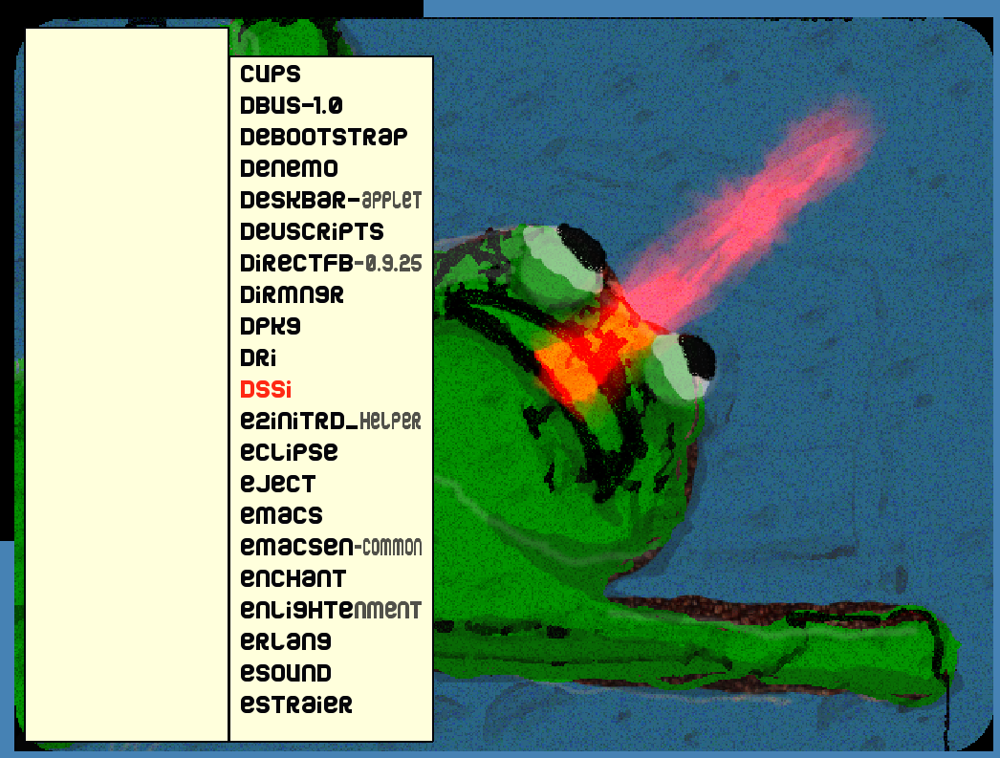
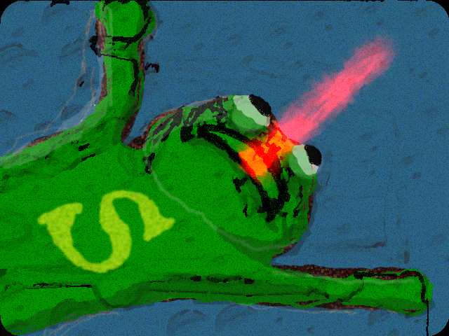

Superfrog Menu System
=====================

This is an odd little program from 2007, for displaying a simple menu with Python and Pygame.

| Screenshot                        | Logo                            |
|-----------------------------------|---------------------------------|
|  |  |

I have recently ported it to Python 3 and tested it with Python 3.8 and it needs more testing.

General info
------------

* Version: 1.0.0
* License: GPL2
* Author: Alexander F. Rødseth &lt;rodseth@gmail.com&gt;
